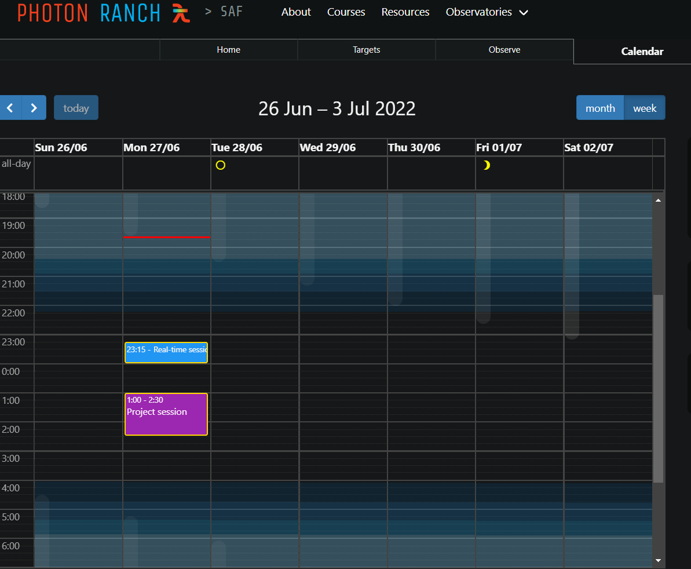
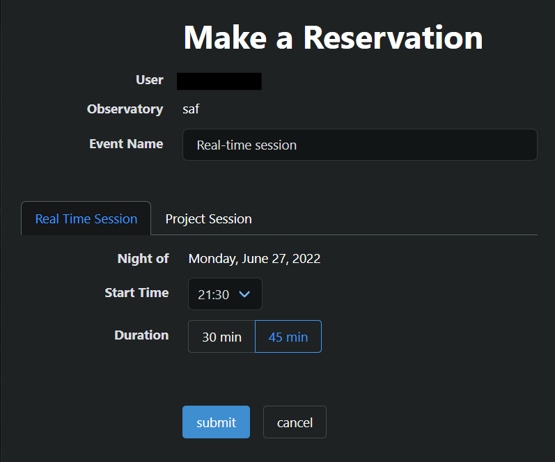

# Photon Ranch Calendar

This repository manages the backend service for the calendar at [www.photonranch.org](https://photonranch.org). Communication between the web interface and calendar database operations at AWS occur here.

This is a Serverless API deployed by the Serverless Framework, which creates and runs the Python functions in `handler.py` in AWS Lambda.



## Description

The Photon Ranch calendar allows authenticated users to create and manage reservations for real time and automated observing sessions. Each site page has a calendar tab. Users can request to:

- Add a new reservation to the calendar
- Modify an existing reservation
- Add or remove a [project](https://github.com/LCOGT/photonranch-projects) to a reservation
- Delete a reservation from the calendar



### Architecture

## Dependencies

This application currently runs under Python 3.9. Serverless requirements for deployment are listed in `package.json`.
A list of Python dependencies, which the `serverless-python-requirements` plugin zips for the Lambda environment, can be found in `requirements.txt`.

To update npm dependencies, run `npm update`. This will update the package versions in `package-lock.json`.

## Local Development

Clone the repository to your local machine:

```bash
$ git clone https://github.com/LCOGT/photonranch-calendar.git
$ cd photonranch-calendar
```

### Requirements

You will need the [Serverless Framework](https://www.serverless.com/framework/docs/getting-started) installed locally for development.
For manual deployment to AWS as well as for updating dependencies, you will need to install [Node](https://nodejs.org/en/),
[npm](https://docs.npmjs.com/downloading-and-installing-node-js-and-npm),
and [AWS CLI](https://docs.aws.amazon.com/cli/latest/userguide/getting-started-install.html),
configuring with your own AWS credentials.

### Deployment

Changes to the main and dev branches are automatically deployed to the corresponding prod and dev stages with Github Actions.
It is recommended to use this as the primary way to deploy changes.
For manual deployment on your local machine, you'll first need to fill out the `public_key` and `secrets.json` with the
required information, and install packages:

```shell
$ npm install
$ serverless plugin install --name serverless-python-requirements
$ serverless plugin install --name serverless-dynamodb-pitr
$ serverless plugin install --name serverless-domain-manager
```

To deploy, run:

```bash
$ serverless deploy --stage {stage}
```

In the case that a Serverless or AWS key has been reset, you will need to update these manually in this repository's
settings for Github Actions to continue deploying. You must be a repository collaborator to edit these.

### Testing

Ensure the python requirements are installed by running `pip install -r requirements.txt`, ideally in a virtual environemnt.
Then run tests with `python -m pytest`.

## Calendar Event Syntax

The body of a calendar event follows the JSON format below:

```javascript
{
    "event_id": "024242f...",  // Unique ID generated for each new reservation
    "start": "2022-06-20T16:15:00Z",  // Starting UTC date and time of reservation
    "end": "2022-06-20T16:45:00Z",  // Ending UTC date and time of reservation
    "creator": "Firstname Lastname",  // String of user display name
    "creator_id": "google-oauth2|xxxxxxxxxxxxx",  // Auth0 user 'sub' string
    "site": "saf",  // Sitecode where reservation was made
    "title": "My Name",  // Name of reservation, defaults to username
    "reservation_type": "realtime",  // String, can be "realtime" or "project"
    "origin": "ptr", // "ptr" if created on the ptr site, or "lco" if the event was created by the lco scheduler
    "resourceId": "saf",  // Sitecode where reservation was made
    "project_id": "none",  // Or concatenated string of project_name#created_at timestamp
    "reservation_note": "",  // User-supplied comment string, can be empty
}
```

## API Endpoints

Calendar requests are handled at the base URL `https://calendar.photonranch.org/{stage}`, where `{stage}` is `dev` for the dev environment, or `calendar` for the production version.

All datetimes should be formatted yyyy-MM-ddTHH:mmZ (UTC, 24-hour format)

- POST `/newevent`
  - Description: Create a new reservation on the calendar.
  - Authorization required: Yes.
  - Request body: JSON body as specified in the syntax above.
  - Responses:
    - 200: update calendar table and add new calendar event.
    - 400: missing required key in `[event_id, site, start]` in the request body.

- POST `/modifyevent`
  - Description: Update an existing calendar reservation with changes.
  - Authorization required: Yes.
  - Request body: JSON body with changes following the syntax above.
  - Responses:
    - 200: update calendar event.
    - 403: unauthorized request.

- POST `/add-projects-to-events`
  - Description: Adds a user's existing projects to a calendar event.
  - Authorization required: No.
  - Request body:
    - `project_id` (string): id of project in the format "Project Name#UTC timestamp".
    - `events` (array): dicionaries for each calendar event to update.
  - Responses:
    - 200: update calendar event.

- POST `/remove-project-from-events`
  - Description: Removes a user's existing projects from a calendar event by setting `project_id` to `'none'`.
  - Authorization required: No.
  - Request body:
    - `events` (array): dictionaries for each calendar event to update.
  - Responses:
    - 200: success.

- POST `/delete`
  - Description: Delete a calendar event given an event_id.
  - Authorization required: Yes.
  - Request body:
    - `event_id` (string): id of event to delete.
    - `start` (string): UTC datestring of the event's starting time.
    - `creator_id` (string): Auth0 user 'sub' string of the original event creator.
  - Responses:
    - 200: success deleting event.
    - 403: unauthorized request.

- POST `/siteevents`
  - Description: Return a list of events at a specific site within a specified date range.
  - Authorization required: No.
  - Request body:
    - `start` (string): UTC datestring of the event's starting time.
    - `end` (string): UTC datestring of the event's ending time.
    - `site` (string): sitecode (eg. 'saf').
  - Responses:
    - 200: return matching events.
    - 400: missing required key in request body.

- POST `/user-events-ending-after-time`
  - Description: Return a list of user events that end after a specified time.
  - Authorization required: No.
  - Request body:
    - `user_id` (string): Auth0 user 'sub' string of requester.
    - `time` (string): UTC datestring of the time to check after.
  - Responses:
    - 200: return matching events.

- POST `/get-event-at-time`
  - Description: Return a list of events that are happening at a given time.
  - Authorization required: No.
  - Request body:
    - `time` (string): UTC datestring of the time to check for events.
    - `site` (string): sitecode.
  - Responses:
    - 200: return matching events.

- POST `/is-user-scheduled`
  - Description: Check if a user is scheduled for an event at a specific site and time.
  - Authorization required: No.
  - Request body:
    - `user_id` (string): Auth0 user 'sub' string of the user to check.
    - `site` (string): sitecode.
    - `time` (string): UTC datestring of the time to check for events.
  - Responses:
    - 200: return matching users.

- POST `/does-conflicting-event-exist`
  - Description: Check if an existing event conflicts while making a reservation.
  - Authorization required: No.
  - Request body:
    - `user_id` (string): Auth0 user 'sub' string of the requesting user to compare with other events.
    - `site` (string): sitecode.
    - `time` (string): UTC datestring of the time to check for events.
  - Responses:
    - 200: true if conflicting events from a different user exist at the same time.
    - 200: false if no conflicting events exist.

## Integration with LCO Observations

This repository includes functionality that imports observations scheduled by LCO for Photon Ranch observatories and translates them into Photon Ranch projects and calendar events to be easily run at Photon Ranch observatories.

### Schedule Import Endpoints

- GET `/import-schedules`
  - Description: Trigger a manual import of the latest schedules from LCO for all subsites.
  - Authorization required: No.
  - Response: 200 with details of updated schedules.

- GET `/import-schedules/{subsite}`
  - Description: Trigger a manual import for a specific subsite (e.g., 'mrc1').
  - Authorization required: No.
  - Path Parameters:
    - `subsite` (string): The subsite code to update (e.g., 'mrc1', 'mrc2').
  - Response: 200 with details of the update for the specified subsite.

### Automatic Schedule Synchronization

The system also runs a scheduled task every 5 minutes that:

1. Checks if new schedules are available for each subsite by comparing the last schedule time at the site-proxy with our last tracked update time
2. Only updates calendar events when necessary to avoid redundant operations
3. Manages each subsite (telescope) independently for more granular control

### Site and Subsite Terminology

- **WEMA** (or "Site" in LCO terminology): A geographic location with multiple telescopes (e.g., MRC, ECO, ARO)
- **Subsite** (or "PTR Site"): A specific telescope at a WEMA (e.g., MRC1, MRC2)

The scheduler imports observations for each subsite from their respective WEMAs, creating Photon Ranch projects and calendar events to facilitate observations.

### Configuration

The system can be configured in several ways:

1. **Available Sites**: Sites available for scheduling are configured in `import_schedules.py`:

   ```python
   # Only query scheduler for observations at these sites
   SITES_TO_USE_WITH_SCHEDULER = [
       "mrc",
       "aro",
       "eco",
   ]
   ```

   To add or remove a site, simply modify this list.

2. **Site-to-Telescope Mapping**: The mapping between WEMAs, telescope IDs, and PTR sites is also configured in `import_schedules.py` through the `SITE_FROM_WEMA_AND_TELESCOPE_ID` dictionary.

3. **Update Frequency**: The automatic update interval can be adjusted in `serverless.yml` under `functions.importSchedulesFromLCO`.

### Schedule Tracking

The system maintains a DynamoDB table to track when schedules were last updated for each subsite. This allows for efficient synchronization by only updating when newer schedules are available.
